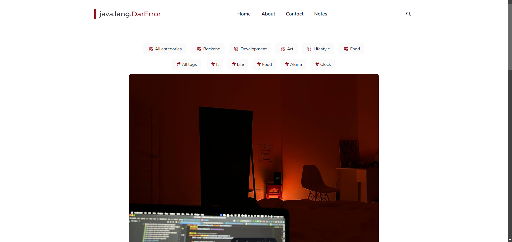

<h1 align=center>DarError Blog</h1>



Привет! Это теперь твой блог 😄 (если, конечно, ты решишь им воспользоваться). Это тебе презент как от джависта джависту. Ну и просто за твой контент, который ты пилишь (спасибо!). Тут я опишу основные моменты, как все устроено и как править этот блог.

## 🔑 Ключевые фичи

- 🎨 Это блог со статьями!
- 🔍 Поиск на основе FuseJS
- 🏷️ Есть темы и тэги
- ⚡ Очень быстрая работа сайта (95+ Google PageSpeed Score)
- ✍️ Весь контент пишется в Markdown / MDX (и это кайф)
- 📚 Автоматический подхват MDX-файлов 
- 🚀 Astro JS + Tailwind CSS
- ⚙️ Netlify предварительно настроен
- 📱 Полностью отзывчивый интерфейс (Desktops, Tablets, and Smartphones)
- 🔍 Можно легко подключить SEO

## 🔧Установка

После загрузки проекта, нужно будет выполнить предварительную настройку.

### ⚙️ Предварительная настройка (Единожды)

- **Установить NodeJS:** [Install](https://nodejs.org/en/download/)

### 🖥️ Локальная сборка

Открой этот проект в любой IDE [[VS Code](https://code.visualstudio.com/) как вариант], затем открой терминал из директории с проектом [vs code shortcut - <code>ctrl/cmd+\`</code>] и выполни следующее:

- Установи зависимости:

```
npm install
```

- Запусти локальный сервер:

```
npm run dev
```

После откроется окно в браузере, где будет отображаться сайт. Если этого не произошло, можешь открыть сама по адресу [localhost:4321](http://localhost:4321/).

### 🔨Продакшн сборка

После завершения всего вышеизложенного ты можешь создать продакшн сборку, выполнив эту команду:
```
npm run build
```

Затем сформируется папка `build`, которую нужно перенести на хостинг продакшна.

### 🖥️ Как добавить контент или изменить
Есть 3 основные директории, которые тебе придется изучить, чтобы менять / добавлять контент в блог. 

1. `\public\images` - директория, в которой хранятся все изображения сайта. Также там ты найдешь вложенную директорию `\posts`, в которой хранятся изображения для статей блога;
2. `\src\config` - там хранятся json`ы для настройки сайта (можешь поизучать, там все должно быть понятно);
3. `\src\content` - в этой директории хранится весь контент сайта:
   - `\about\index.md` - контент страницы About;
   - `\pages\404.md` - контент страницы 404 (не найдено);
   - `\pages\contact.md` - контент страницы Contact;
   - `\pages\notes.md` - контент страницы Notes (сейчас там просто примеры того, какие элементы можно использовать);
   - `\posts\post-{}.md` - контент страниц самого блога. Для добавления нового поста в блог - надо добавить новый файл с номером +1 от последнего и изменить контент по подобию уже существующих постов;

По сути это все директории, в которых тебе нужно будет что-то менять. Понимаю, структура проекта может быть сложновата для понимания, нноо, такой уж Astro JS).

## 👨‍💻Нужна помощь или нужно что-то поменять?

Напиши мне в [Telegram](https://t.me/ARadeckiy) и я поменяю все что нужно под тебя или помогу разобраться с проектом 😄
